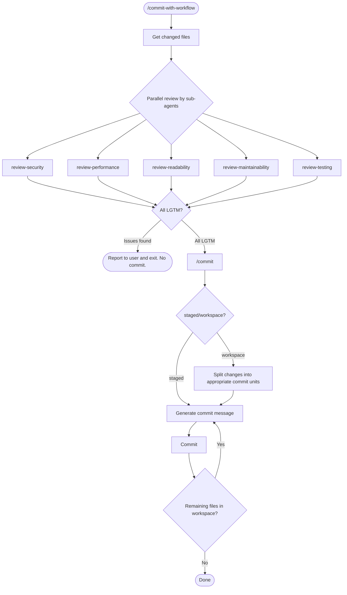

# claude-only-commit-workflow

## Overview

A SKILL Plugin for Claude Code

- Prevents manual `git commit` and restricts commits to Claude only
- Automates code review and commit message generation

## Available Skills

| Skill                   | Description                                                                    | Review |
| ----------------------- | ------------------------------------------------------------------------------ | ------ |
| `/commit-with-workflow` | Runs code review with 5 sub-agents and commits only if all reviews pass (LGTM) | Yes    |
| `/commit`               | Commits immediately without review                                             | No     |

## Workflow

### `/commit-with-workflow`

## File Structure

| File                                   | Role                                                  |
| -------------------------------------- | ----------------------------------------------------- |
| `skills/commit-with-workflow/SKILL.md` | `/commit-with-workflow` main flow                     |
| `skills/commit/SKILL.md`               | `/commit` commit message generation and execution     |
| `skills/get-target-files.md`           | Retrieves changed files (staged or workspace)         |
| `agents/review-*.md`                   | Individual sub-agents for each review category        |
| `skills/review-output-format.md`       | Output format specification for each sub-agent        |
| `hooks/hooks.json`                     | Hook that blocks `git commit` from outside of Claude  |
