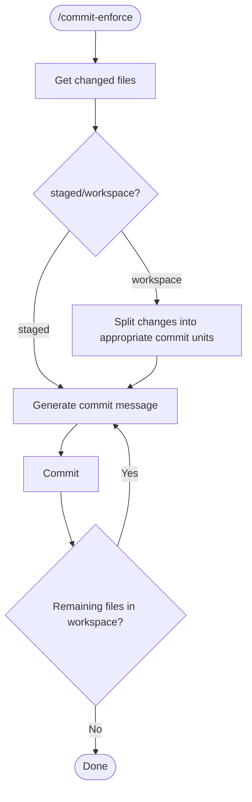

# git-github-workflow

## Overview

A skill plugin for Claude Code

- Prevents manual `git commit` and restricts commits to Claude only, with automated commit
  message generation
- Confirms base branch/prefix/suffix via `AskUserQuestion`, creates a git worktree and
  working branch with `git worktree add --no-track`, and switches the session into it
- Extracts a GitHub issue number from the branch name when present, generates a pull
  request title and body from the diff, and creates it with `gh pr create`

## Available Skills

| Skill                       | Description                                                                 | Auto-invocation |
| ---------------------------- | ---------------------------------------------------------------------------- | ---------------- |
| `/commit-enforce`           | Commits immediately without review                                          | Enabled |
| `/create-worktree-and-branch` | Creates a git worktree and branch from an interactively chosen base/prefix/suffix, then switches into it | Enabled |
| `/create-pull-request`      | Generates a pull request title and body from branch name and diff, then creates it | Enabled |

## Workflow

### `/commit-enforce`



## File Structure

| File                                              | Role                                                        |
| --------------------------------------------------- | ------------------------------------------------------------ |
| `skills/commit-enforce/SKILL.md`                  | `/commit-enforce` commit message generation and execution   |
| `skills/get-commit-target-files.md`               | Retrieves changed files (staged or workspace)                |
| `skills/create-worktree-and-branch/SKILL.md`      | Confirms base branch/prefix/suffix, creates the worktree and branch, and switches into it |
| `skills/create-pull-request/SKILL.md`             | Extracts issue number, confirms merge target/title, generates body, creates PR |
| `hooks/hooks.json`                                | Triggers `SessionStart` to run the install script            |
| `scripts/install-git-pre-commit-hook.sh`          | Installs the `pre-commit` hook that blocks direct `git commit` unless `CLAUDE_COMMIT_ALLOWED` is set |

## Notes

- No Backlog dependency. `create-pull-request` extracts a GitHub issue number from the branch name
  instead, and treats it as optional since not every branch carries one
- No `--reviewer` option is passed to `gh pr create`
- The worktree is created under `.claude/worktrees/<suffix>` at the repository root, which is
  the directory Claude Code's own `--worktree` flag and `EnterWorktree` tool also use
- `.gitignore` entries and gitignored files such as `.env` are not copied into the new
  worktree automatically

## Cleanup

If needed, remove the following block from each repository's `.git/hooks/pre-commit` file manually:

```bash
# [commit-enforce]
if [ -f "/path/to/plugin-data/enabled" ] && [ -z "$CLAUDE_COMMIT_ALLOWED" ]; then
  echo "Direct git commit is disabled. Use /commit-enforce in Claude Code." >&2
  exit 1
fi
```

Note that after uninstalling the plugin, the `enabled` marker file is removed automatically, so the hook becomes a no-op even without deleting this block.
