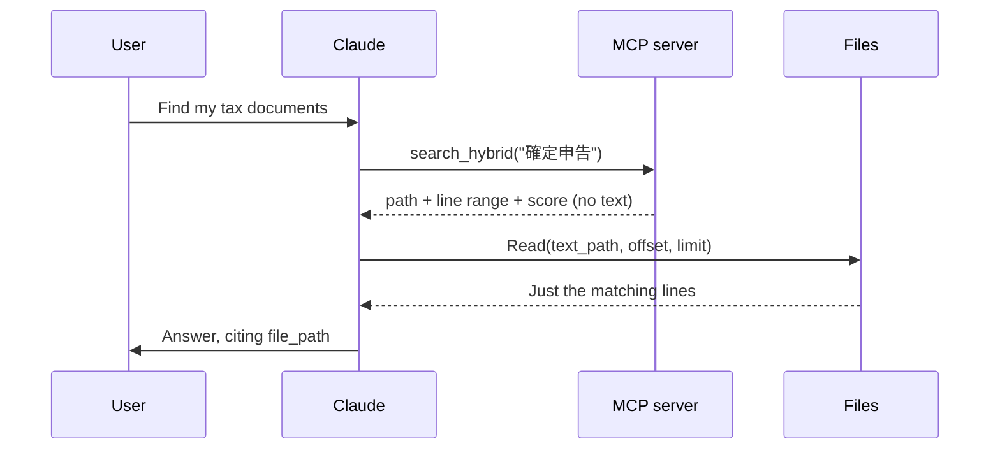
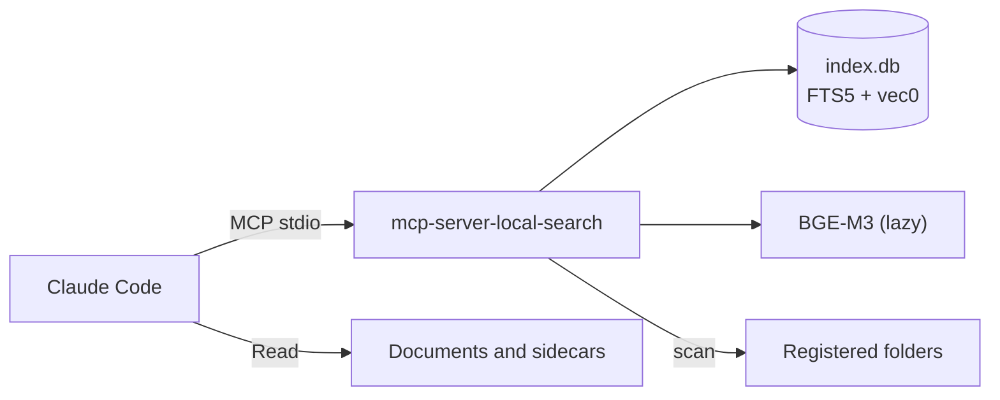

# local-doc-search

## Overview

A Skill + MCP Plugin for Claude Code

- Searches documents on your own machine by keyword, by meaning, or by both combined
- Handles Markdown, plain text, PDF, Word, and PowerPoint, including CP932/Shift_JIS text
- Runs entirely locally: document contents are never sent to an external API
- Returns only where to look (path, line range, score) and never document text, so Claude reads just the relevant lines with `Read`

## Available Skills

| Skill                 | Description                                                              |
| --------------------- | ------------------------------------------------------------------------ |
| `local-search`        | Picks a search mode, reads the matching lines, and answers in Japanese   |
| `local-search-setup`  | Registers folders, builds the index, and reports progress                |

Invoke explicitly with `/local-doc-search:local-search <query>`, or let Claude auto-invoke either skill from a request like「PCの資料を探して」.

## MCP Tools

| Tool                  | Purpose                                                        |
| --------------------- | -------------------------------------------------------------- |
| `add_search_path`     | Register a folder to search; refuses overlapping folders        |
| `remove_search_path`  | Drop a folder from the index; never touches the documents       |
| `list_search_paths`   | Show registered folders, file and chunk counts, database size   |
| `start_indexing`      | Build the index in the background and return immediately        |
| `get_index_status`    | Report progress; answers promptly even while indexing           |
| `cancel_indexing`     | Stop the running job; what was indexed stays searchable         |
| `search_fulltext`     | Keyword match ranked by bm25                                    |
| `search_semantic`     | Meaning match ranked by cosine distance                         |
| `search_hybrid`       | Both, fused by Reciprocal Rank Fusion. The default choice       |

## How a Search Works

Search results carry no document text. This keeps the context window for reasoning rather than storage, and avoids duplicating what Claude Code's own `Read` tool already does.

PDF and Office files have no line numbers of their own, so their extracted text is cached as a sidecar keyed by content hash. `text_path` points at that sidecar while `file_path` stays the original document — the one shown to the user.

## Architecture

| Layer            | Choice                       |
| ---------------- | ---------------------------- |
| Full-text search | SQLite FTS5, trigram tokenizer |
| Vector search    | sqlite-vec, 1024 dimensions  |
| Embeddings       | BGE-M3 via sentence-transformers, CPU-only |
| Text extraction  | MarkItDown                   |
| MCP SDK          | Official `mcp` package, `MCPServer` API |

Indexing runs on a worker thread: embedding is CPU-bound and would otherwise freeze the event loop, leaving `get_index_status` unanswerable.

## File Structure

| File                                     | Role                                                       |
| ---------------------------------------- | ---------------------------------------------------------- |
| `skills/local-search/SKILL.md`           | Search entry point; mode selection and two-phase reading   |
| `skills/local-search-setup/SKILL.md`     | Folder registration and index building                      |
| `mcp-server-local-search/`               | The MCP server (see its own README)                         |
| `docs/`                                  | Japanese design documents; start at `docs/README.md`        |

## Notes

- Requires `uv` on PATH. The first index build downloads about 4.3GB of model files.
- With the Claude Code sandbox enabled, allow `download.pytorch.org` and `huggingface.co` (plus `*.huggingface.co`, `*.hf.co`).
- Two-character queries fall back to a full scan because a trigram index cannot hold them. Japanese has many such words, so they narrow results rather than being dropped.
- `.xlsx` and `.rtf` are out of scope for v1.
