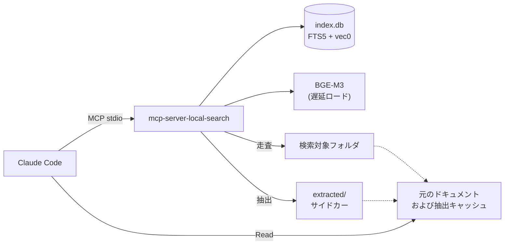
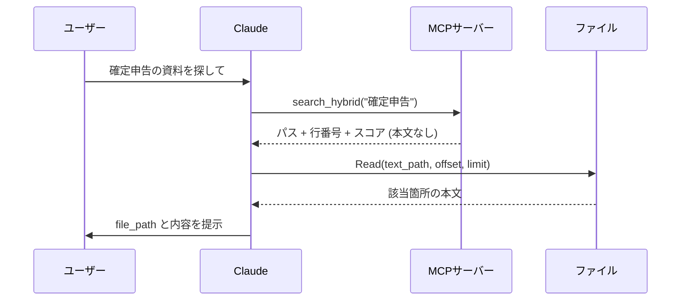
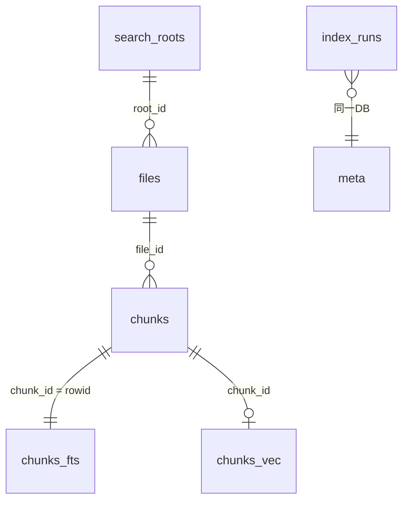

# アーキテクチャ

## 全体構成

## two-phase retrieval

検索ツールは「どこを読むべきか」だけを返し、本文はClaudeが`Read`で必要な範囲だけ読む

| 返す情報 | 返さない情報 |
|---|---|
| ファイルパス、行番号、スコア | ファイル本文、チャンク本文 |

この設計を選ぶ理由

- コンテキストは推論のための領域であり、データ保管のための領域ではない
- 検索ツールが本文を返すと、Claude Codeが持つ`Read`ツールと役割が重複する
- 行番号があれば、Claudeが前後の文脈を含めて読み直せる

### PDF/Office文書の扱い

元ファイルに行番号の概念がないため、抽出したMarkdownをサイドカーとして保存する

| フィールド | 平文形式 | PDF/Office |
|---|---|---|
| `file_path` | 元ファイル | 元ファイル |
| `text_path` | `file_path`と同一 | `extracted/<hash[:2]>/<hash>.txt` |

サイドカーのキーは内容のsha256とする
同一内容のファイルはキャッシュを共有し、内容が変わると別ファイルになるため不整合が起きない

**ユーザーに提示するのは常に`file_path`**
`text_path`は内部キャッシュのパスであり、ユーザーには意味を持たない

## データ配置

`${CLAUDE_PLUGIN_DATA}`配下に集約する

| パス | 内容 |
|---|---|
| `index.db` | FTS5とvec0を含む単一のSQLiteファイル |
| `extracted/` | PDF/Officeから抽出したテキストのサイドカー |
| `models/` | BGE-M3のキャッシュ (約4.3GB) |

`${CLAUDE_PLUGIN_DATA}`は`~/.claude/plugins/data/<plugin-name>-<marketplace-name>/`に解決される
MCPサーバープロセスへ環境変数として渡るかは保証されないため、`plugin.json`の`args`で`--data-dir`として明示的に受け渡す
未展開の場合 (`${`が残っている場合) は`~/.local/share/local-doc-search/`へフォールバックする

## DBスキーマ

| テーブル | 役割 |
|---|---|
| `meta` | スキーマバージョン、モデル名、チャンク設定 |
| `search_roots` | 検索対象フォルダ |
| `files` | ファイルのメタデータ、差分判定用のsize/mtime/hash |
| `chunks` | チャンク本文と行範囲 |
| `chunks_fts` | FTS5仮想テーブル (外部コンテンツ、trigram) |
| `chunks_vec` | vec0仮想テーブル (float[1024]) |
| `index_runs` | インデックスジョブの状態と進捗 |

### 設計上の要点

`chunks_fts`は外部コンテンツテーブル (`content='chunks'`) とし、本文の二重保持を避ける
trigramインデックスは元データの約2.6倍に膨らむため、この節約は効果が大きい

外部コンテンツテーブルは自動同期されないため、`chunks`への挿入/更新/削除に追随するトリガを定義する
削除は`insert into chunks_fts(chunks_fts, rowid, text) values('delete', ...)`という特殊な構文を使う
通常の`DELETE`では索引に古い投稿が残り、削除済み文書が検索結果に出続ける

`chunks_fts`と`chunks_vec`は同一の`chunk_id`を指す
このためRRF統合が共通ID空間で成立する。FTS用とベクトル用でチャンク粒度を分けない理由がこれ

`chunks_vec`は仮想テーブルのため外部キーが効かない
`chunks`をCASCADE削除してもベクトルは残るため、`db.delete_file_chunks()`で削除順序を明示的に管理する

## 並行処理

インデックス処理をそのまま`asyncio.create_task()`で走らせると、BGE-M3の推論がCPUバウンドな同期処理のためイベントループを占有し、MCPサーバー全体が応答不能になる

対策としてインデックスのワーカー全体を専用スレッドで実行する
torchの演算はC++層でGILを解放するため、スレッド方式でもイベントループは正常に回り続ける

| 項目 | 対処 |
|---|---|
| SQLite接続 | `check_same_thread=False`で共有し、書き込みは`db.write_lock`で直列化 |
| 進捗の受け渡し | `index_runs`テーブル経由、WALモードにより読み取りはブロックされない |
| キャンセル | `threading.Event`をファイル単位のループ先頭で確認 |
| 中断の復旧 | 起動時に`running`のまま残った行を`interrupted`へ更新 |

MCP SDKは同期のツール関数をワーカースレッドで実行するため、`lifespan`で開いたSQLite接続は必ず別スレッドから使われる
これが`check_same_thread=False`が必要な理由

## 環境変数

| 変数 | 用途 |
|---|---|
| `HF_HOME` | 実装側で`models/`に設定。HuggingFaceの転送機構が`~/.cache/huggingface`へ書き込むのを防ぐ |
| `HF_HUB_DISABLE_TELEMETRY` | 実装側で`1`に設定 |
