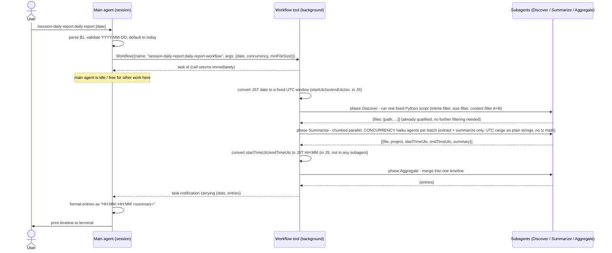
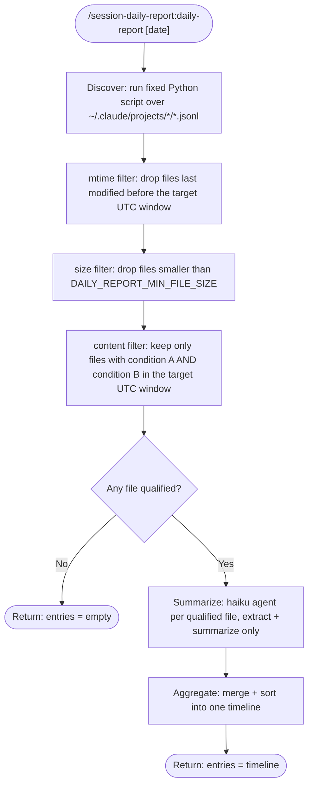

# session-daily-report

## Overview

A Workflow Plugin for Claude Code

- Scans every Claude Code session history JSONL file under `~/.claude/projects/*/*.jsonl`, across all projects
- Filters activity to a single date, converting UTC timestamps to JST
- Summarizes each project's activity for that date with a haiku-model subagent per file, then merges everything into one sorted Japanese timeline
- Prints the result to the terminal only; nothing is saved to disk

## Available Commands

| Command                                          | Description                                                |
| --------------------------------------------------- | -------------------------------------------------------------- |
| `/session-daily-report:daily-report [YYYY-MM-DD]` | Generates a JST daily work-report timeline; defaults to today |

### Arguments

| Field  | Type   | Required             | Description                            |
| -------- | ------ | ----------------------- | ------------------------------------------ |
| `date` | string | No (default: today)  | Target date in `YYYY-MM-DD`, JST basis |

### Environment Variables

| Variable                     | Required            | Description                                                                                   |
| ------------------------------ | ---------------------- | ------------------------------------------------------------------------------------------------- |
| `DAILY_REPORT_CONCURRENCY`   | No (default: `10`)   | Max concurrent `haiku` summarize subagents. Must be a positive integer; any other value falls back to the default |
| `DAILY_REPORT_MIN_FILE_SIZE` | No (default: `30000`) | Session files smaller than this (bytes) are skipped as a fast pre-check, before the (authoritative) content filter runs. Must be a non-negative integer; any other value falls back to the default. `0` disables the filter |

`DAILY_REPORT_CONCURRENCY` can only lower the effective concurrency, not raise it. The `Workflow` tool itself caps concurrent `agent()` calls at `min(16, available CPUs - 2)` per workflow run, regardless of this variable — any excess calls queue and run as slots free up. Setting `DAILY_REPORT_CONCURRENCY` above that platform-level cap has no effect on actual wall-clock parallelism

## Architecture: Main Agent <-> Workflow

The `Workflow` tool is asynchronous: calling it returns a task ID immediately, and the main agent (the session handling your slash command) is free while the workflow runs in the background. The result only reaches the main agent later, as a task-notification event — the main agent does not block on it in the usual tool-call sense.

- The workflow's final `return { date, entries }` becomes the payload of the task-notification, not a normal synchronous return value
- `commands/daily-report.md` is the only place that talks to the user directly; the workflow itself never prints anything, it only returns structured data
- Because the call is async, if the user sends another message before the notification arrives, the main agent must treat that as a status check, not as an answer to a pending question

## Internal Workflow Stages

## Discover Filter Conditions

The Discover stage runs a single fixed Python script (written once by the plugin author, executed verbatim by the Discover subagent — never authored on the fly by the model) that performs three filter layers in order, over `~/.claude/projects/*/*.jsonl`. Only files that survive all three layers are passed to the Summarize stage.

All time comparisons inside this script are UTC-only, using plain ISO8601 string comparison (no datetime library, no timezone conversion). The target UTC window (`startUtcIso`/`endUtcIso`) is computed exactly once, in `workflows/daily-report.js` itself, from the user-facing `date` argument — which is a **JST** calendar date. That JST-to-UTC conversion is the only place a target date turns into a UTC boundary; the script itself never sees or reasons about JST.

1. **mtime filter** — a file whose last-modified time is before `startUtcIso` is dropped outright. Session files are append-only logs, so if nothing was ever written to a file during or after the target date, it cannot contain a matching line. This is a logical guarantee, not a heuristic.
2. **size filter** (`DAILY_REPORT_MIN_FILE_SIZE`, default `30000` bytes) — a file smaller than this is dropped before its content is read. Safe as a fast pre-check because every file observed to satisfy the content filter below was well over this size in this project's history (incidental content — hook `attachment` entries, `thinking` blocks — reliably pushes a file with any real exchange past this size).
3. **content filter** — for the remaining files, the script reads each line as JSON and keeps only files where, within the target UTC window, **both** of the following hold:
   - **Condition A (real human message)**: a line with `type=="user"`, `message.content` is a string, `origin.kind=="human"`, and `promptSource=="typed"`. This excludes local-command-injected text (e.g. `<local-command-caveat>`, `<command-name>/model</command-name>`), which is not something the user actually typed as a message.
   - **Condition B (real assistant reply)**: a line with `type=="assistant"` whose `message.content` list contains at least one element with `type=="text"` or `type=="tool_use"`. A `thinking`-only entry does not count — the assistant must have actually replied or acted.

   A file satisfying only A (e.g. a lone one-word message with no reply) or only B is excluded — both are required. This is what filters out sessions like a single `clear` message typed by the user with no subsequent assistant response.

Because qualification is fully decided in Discover, the Summarize stage no longer determines activity at all — it only extracts the matching lines from an already-qualified file and writes the Japanese summary, returning the raw UTC `startTimeUtc`/`endTimeUtc` of the earliest/latest matching line. `workflows/daily-report.js` converts those to JST `HH:MM` for display; every other time value in this pipeline is UTC.

## File Structure

| File                          | Role                                                                    |
| -------------------------------| ---------------------------------------------------------------------------|
| `commands/daily-report.md`    | Parses/validates the date argument, invokes the workflow                 |
| `workflows/daily-report.js`   | Orchestrates discovery -> per-file haiku summarize -> aggregate          |

## Notes

- Cross-project by design: reads every project under `~/.claude/projects/`, not just the current one
- Output-only: never writes a report file, only prints to the terminal
- Large session files are read with Bash (grep-style extraction) inside each summarize subagent, to avoid loading multi-MB JSONL files whole into context — see "Discover Filter Conditions" above for where activity qualification actually happens (Discover, not Summarize)
- `workflows/daily-report.js`'s `meta.name` is `daily-report-workflow`, not `daily-report` — Claude Code auto-exposes any registered workflow as a `[dynamic workflow]` slash entry under `<plugin>:<meta.name>`, bypassing argument validation. Keeping it distinct from the `commands/daily-report.md` command name (`daily-report`) avoids two colliding entries for the same text in the `/` autocomplete menu
- All UTC-to-JST conversion happens only in `workflows/daily-report.js` itself (plain `Date` arithmetic, no timezone library) — never inside the Discover script or any subagent. Earlier revisions asked each summarize subagent to do its own UTC→JST conversion, and `haiku` intermittently wrote broken inline Python for it (offset-naive/aware comparison errors, syntax errors), which surfaced as failed pipeline items and repeated workflow retries
