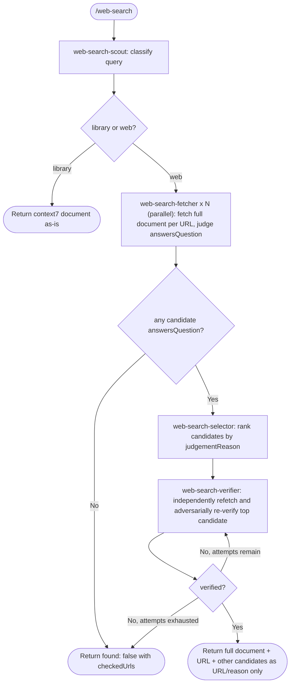

# web-search-plugin

## Overview

A Skill + Workflow Plugin for Claude Code

- Classifies the query, then fetches candidate documents in full (no summarization) via a staged pipeline
- Judges every candidate for relevance, ranks them, and re-verifies the top candidate independently and adversarially before returning it
- Never fabricates an answer: if nothing passes verification, it reports that plainly instead of guessing
- Bundles the `context7`, `fetch`, and `playwright` MCP servers

## Available Skills

| Skill        | Description                                                                                          |
| ------------- | ------------------------------------------------------------------------------------------------------ |
| `web-search` | Runs Search → Fetch → Select → Verify and returns one verified document, or reports nothing was found |

Invoke explicitly with `/web-search <query>`, or let Claude auto-invoke it when it judges that accurate primary-source information is needed (per the skill's `description`).

### Workflow Arguments

| Field               | Type   | Required          | Description                                                          |
| -------------------- | ------ | ------------------ | ----------------------------------------------------------------------- |
| `query`              | string | Yes                | The question or topic to research                                    |
| `maxUrls`            | number | No (default: `5`)  | Max number of URLs fetched in parallel in the Fetch phase            |
| `maxVerifyAttempts`  | number | No (default: `3`)  | Max number of top-ranked candidates re-verified in the Verify phase  |

## Workflow

## MCP Servers

This plugin bundles the following MCP servers, started automatically when enabled:

| Server       | Command                                                | Purpose                                                                                                                        |
| ------------ | ------------------------------------------------------ | ------------------------------------------------------------------------------------------------------------------------------ |
| `context7`   | `npx -y @upstash/context7-mcp`                         | Library/API documentation lookup                                                                                               |
| `fetch`      | `uv run --project ./mcp-server-fetch mcp-server-fetch` | Fetch a URL as unsummarized Markdown/HTML (local customized fork; see `mcp-server-fetch/README.md` for the diff from upstream) |
| `playwright` | `npx -y @playwright/mcp@latest`                        | Fetch JS-dependent pages via a real browser                                                                                    |

Requires `npx` and `uv` to be available in the environment. The `fetch` server runs from a local, customized fork bundled in `mcp-server-fetch/` (see that directory's README for the differences from the upstream `mcp-server-fetch` package on PyPI), rather than being installed via `uvx`.

## File Structure

| File                              | Role                                                                                     |
| ----------------------------------- | ------------------------------------------------------------------------------------------ |
| `skills/web-search/SKILL.md`      | Entry point; invokes `workflows/web-search.js` via the `Workflow` tool                    |
| `workflows/web-search.js`         | Orchestrates Search → Fetch → Select → Verify                                            |
| `agents/web-search-scout.md`      | Classifies the query; gets context7 docs or WebSearch candidate URLs, does not fetch them |
| `agents/web-search-fetcher.md`    | Fetches one URL in full and judges relevance; does not return the full document           |
| `agents/web-search-selector.md`   | Ranks candidates using judgement reasons only                                             |
| `agents/web-search-verifier.md`   | Independently re-fetches and adversarially re-verifies one URL; returns full content only if verified |

## note

ClaudeはWebSearchだけしてWebFetchせず、URLだけ返すことがある

また、`WebFetch`は内部でhaikuが要約するため、原文がそのまま渡らない

そのため、本pluginを利用して検索することで、要約を挟まない完全なdocumentの取得と、独立した敵対的検証による内容確認を確実に担保する
